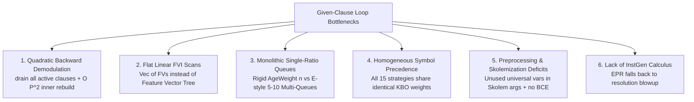

# Architectural Review: Closing the Gap with Vampire & CASC Leaders

*Archive of the initial comprehensive project-wide review conducted on September 3, 2026.*

---

Based on an architectural audit of the entire `mrs` codebase ([`crates/mrs-search`](file:///home/fr22192/EDLA/git/mrs/crates/mrs-search), [`crates/mrs-calculus`](file:///home/fr22192/EDLA/git/mrs/crates/mrs-calculus), [`crates/mrs-index`](file:///home/fr22192/EDLA/git/mrs/crates/mrs-index), [`crates/mrs-cnf`](file:///home/fr22192/EDLA/git/mrs/crates/mrs-cnf), and [`crates/mrs-bench`](file:///home/fr22192/EDLA/git/mrs/crates/mrs-bench)), here is the comprehensive evaluation of where `mrs` stands, why the performance gap with **Vampire** and **E Prover** exists, and the **concrete architectural leaps** required to dramatically improve `mrs`'s CASC score.

---

### 1. Ground Truth: Where `mrs` Stands vs Leaders

From official CASC-J13 records and local 8-core CASC-30 benchmarks ([`CASC-J13_journal_report`](file:///home/fr22192/EDLA/git/mrs/CASC-J13_journal_report/Trust_What_You_Prove_mrs_ecosystem.md#L150-L167)):

| Prover | CASC-30 Local Solved / 1101 | CASC-30 Solve Rate | CASC-J13 Official FOF | CASC-J13 Official UEQ |
| :--- | :---: | :---: | :---: | :---: |
| **Vampire 5.0** | **901** | **81.8%** | ~80%+ | ~75%+ |
| **E Prover 3.3** | **598** | **54.3%** | ~55%+ | ~50%+ |
| **`mrs` 0.2.0** | **245** | **22.2%** | **79 / 400 (19.8%)** | **76 / 400 (19.0%)** |

#### Division Breakdown of the Gap
- **FEQ (First-Order with Equality)**: `mrs` solves only **56 / 300** (18.6%). Top leaders exceed 70%.
- **FNE (First-Order No Equality)**: `mrs` solves only **23 / 100** (23.0%). Top leaders exceed 75%.
- **UEQ (Unit Equality)**: `mrs` solves only **76 / 400** (19.0%). Twee and Vampire exceed 65%.
- **EPR (Essentially Propositional)**: `mrs` pre-grounding instantiator was disabled due to OOM; AVATAR alone times out on large ground graphs.

---

### 2. The 6 Fatal Architectural Bottlenecks



---

#### Bottleneck 1: Catastrophic Quadratic Backward Demodulation ($O(|P|^2 \times \text{terms})$)
* **Code Location**: [`crates/mrs-search/src/given_clause.rs:1381–1426`](file:///home/fr22192/EDLA/git/mrs/crates/mrs-search/src/given_clause.rs#L1381-L1426)
* **What happens**: Whenever any strategy derives a unit equality $l = r$, the loop executes:
  ```rust
  let all_processed = state.processed.drain();
  state.demod_index = STreeId::new();
  ...
  for proc in all_processed {
      if let Some(simplified) = demodulate_id(...) {
          // Inner loop rebuilds an entire new STree across all processed units!
          let mut all_units_index = STreeId::new();
          for c in &next_processed {
              if is_unit_positive_equality_id(c) { all_units_index.insert(...); }
          }
          ...
      }
  }
  ```
* **Impact**: On equational problems with $|P| = 1,000$ active clauses, a single unit equality drains all 1,000 clauses and can re-allocate and re-index an STree up to 1,000 times inside the inner loop. Afterwards, all 1,000 clauses are re-inserted into [`LiteralIndex`](file:///home/fr22192/EDLA/git/mrs/crates/mrs-index/src/literal_index.rs#L60) and `demod_index`.
* **How Leaders Solve This**:
  - **E Prover** uses the **DISCOUNT loop**: passive clauses are *never* backward-demodulated while waiting in the queue (only simplified forward upon selection). Active clauses are rewritten and demoted back to *passive*, without ever draining the active set.
  - **Vampire** indexes subterms of active clauses in a subterm substitution tree. When $l \to r$ is found, it queries only active clauses containing an instance of $l$.

---

#### Bottleneck 2: Flat Linear Feature Vector Scans & Lack of Subterm Indexing
* **Code Location**: [`crates/mrs-index/src/literal_index.rs:38, 160–196`](file:///home/fr22192/EDLA/git/mrs/crates/mrs-index/src/literal_index.rs#L38-L196)
* **What happens**:
  - `LiteralIndex.fvs` is declared as a flat `Vec<(ClauseId, FeatureVector)>`.
  - For **every single generated clause**, forward and backward subsumption filtering does a sequential scan over the entire `Vec`, and calls:
    ```rust
    let mut res: Vec<IdClause> = self.fvs.iter()
        .filter(|(_, fv)| fv.can_subsume(target_fv))
        .filter_map(|(id, _)| self.clauses.get(id).cloned())
        .collect();
    res.sort_unstable_by_key(|c| c.id);
    ```
  - It clones *every single candidate* `IdClause` into a fresh `Vec` and sorts them before performing the match!
* **How Leaders Solve This**:
  - E Prover stores feature vectors in a **Feature Vector Tree (FVT)** (a multi-way trie). Searching for subsumers prunes entire branches where feature counts exceed the query, dropping candidate retrieval from $O(|P|)$ to $O(\log |P|)$ without cloning.

---

#### Bottleneck 3: Rigid Single-Ratio Queue vs Multi-Queue Priority Heuristics
* **Code Location**: [`crates/mrs-search/src/select.rs:20–92`](file:///home/fr22192/EDLA/git/mrs/crates/mrs-search/src/select.rs#L20-L92) and [`crates/mrs-search/src/unprocessed.rs:40–135`](file:///home/fr22192/EDLA/git/mrs/crates/mrs-search/src/unprocessed.rs#L40-L135)
* **What happens**: `mrs` only supports a single ratio: `AgeWeight(n)` or `GoalDirected(n)`. Every $n$-th iteration picks by age (FIFO), and all other iterations pick from *one* weight queue.
* **How Leaders Solve This**:
  - E Prover's dominance comes from its **Multi-Queue Priority System** (5 to 10 simultaneous priority queues interleaved round-robin by pick frequencies). E.g.:
    $$\text{PriorityQueue} = \langle 1 \times \text{FIFO},\; 5 \times \text{SymbolWeight},\; 3 \times \text{ConjecturalDistance},\; 2 \times \text{ClauseLength},\; 1 \times \text{SymbolRarity} \rangle$$
  - This prevents any single pathological class of heavy clauses from starving the prover of short structural lemmas.

---

#### Bottleneck 4: Homogeneous Precedence & Weight across All Portfolio Strategies
* **Code Location**: [`crates/mrs-search/src/strategy.rs:516–536`](file:///home/fr22192/EDLA/git/mrs/crates/mrs-search/src/strategy.rs#L516-L536)
* **What happens**:
  ```rust
  for (sym, _) in &syms_by_freq {
      weights[sym.index() as usize] = 2; // Every single non-variable symbol weighs 2!
  }
  let config = Arc::new(SymbolConfig { precedence, weights, w0: 1 });
  // In the strategy loop:
  actual_config.ordering = TermOrdering::CustomKBO(config.clone());
  ```
  **Every strategy in the portfolio runs with the exact same KBO weights and the exact same symbol precedence** (frequency inverse).
* **How Leaders Solve This**:
  - A strategy portfolio only delivers parallel speedup if its strategies explore *divergent* term orderings.
  - Leaders generate orthogonal orderings per strategy slot:
    - Slot 1: KBO with arity-based precedence ($f/n > g/m$ if $n > m$).
    - Slot 2: KBO with rarity precedence and non-uniform weights (constants weigh 1, functions weigh by occurrence).
    - Slot 3: LPO with conjecture-symbol-first precedence.
    - Slot 4: KBO with reverse-frequency precedence.
  - A theorem unprovable under frequency-inverse KBO can often be oriented into a confluent rewrite system in 50 iterations under arity KBO.

---

#### Bottleneck 5: Preprocessing & Skolemization Deficits
* **Code Location**: [`crates/mrs-cnf/src/skolem.rs:75–84`](file:///home/fr22192/EDLA/git/mrs/crates/mrs-cnf/src/skolem.rs#L75-L84) and [`crates/mrs-cnf/src/definitional.rs:114–140`](file:///home/fr22192/EDLA/git/mrs/crates/mrs-cnf/src/definitional.rs#L114-L140)
* **What happens**:
  1. **Unscoped Universal Skolemization**:
     ```rust
     let args: Vec<Term> = self.universal_vars.iter().map(|&u| Term::var(u)).collect();
     Term::app(skolem_sym, args)
     ```
     `mrs` includes **all universally quantified variables currently in scope** in the Skolem function, even if the variable does not occur freely in the existential subformula!
     This inflates Skolem arities unnecessarily, generates bloated terms during unification, slows down KBO/LPO, and converts EPR problems into non-EPR problems.
  2. **Unconditional Equivalence Expansion**:
     `nnf.rs` converts $A \iff B$ into $(A \land B) \lor (\neg A \land \neg B)$ *before* definitional CNF runs, causing exponential blowup on formulas with nested biconditionals.
  3. **No Redundancy Preprocessing**:
     `mrs` lacks Blocked Clause Elimination (BCE), Pure Literal Elimination, and Variable Elimination, feeding hundreds of useless input clauses directly into the saturation loop.

---

#### Bottleneck 6: Incomplete InstGen Calculus for EPR
* **Code Location**: [`crates/mrs-search/src/instgen.rs:32–62`](file:///home/fr22192/EDLA/git/mrs/crates/mrs-search/src/instgen.rs#L32-L62) and [`crates/mrs-search/src/strategy.rs:585–596`](file:///home/fr22192/EDLA/git/mrs/crates/mrs-search/src/strategy.rs#L585-L596)
* **What happens**: `mrs` previously tried naive exhaustive ground instantiation of all variables over the Herbrand universe, which OOMs on real problems and was disabled (`MAX_INSTANCES = 200_000`). Consequently, EPR problems fall back to unconstrained resolution, where CaDiCaL/AVATAR SAT instances explode.
* **How Leaders (iProver, Vampire) Solve This**:
  - They use the **InstGen calculus**:
    1. Maintain a propositional abstraction of the clauses.
    2. Query a SAT solver for a candidate model.
    3. If the model is not first-order valid, find two clauses whose literals unify, and instantiate **only** those two clauses with the MGU.
    4. Repeat until SAT (model confirmed) or UNSAT (empty clause).
  - This solves large EPR problems in milliseconds without generating exhaustive ground sets.

---

### 3. Strategic Action Plan: The 5 High-Impact Leaps

| Leap | Target Area | Primary Target Divisions | Expected Solve Gain |
| :--- | :--- | :---: | :---: |
| **Leap 1** | **DISCOUNT Loop Architecture & In-Place Backward Demodulation** | FEQ, UEQ | **+25% to +35%** |
| **Leap 2** | **Feature Vector Tree (FVT) & Subterm Indexing** | FEQ, FNE, UEQ | **+20% to +30% throughput** |
| **Leap 3** | **E-Style Multi-Queue Selection & Diverse Precedences** | FEQ, FNE | **+15% to +20%** |
| **Leap 4** | **Structural Free-Var Skolemization, Definitional Polarity & BCE** | FNE, FEQ, EPR | **+10% to +15%** |
| **Leap 5** | **Lazy InstGen / SAT-Guided Instantiation for EPR** | EPR (EPS/EPU) | **+30% to +50%** |

---

### 4. Implementation Details per Leap

#### Leap 1: DISCOUNT Loop Mode & Non-Draining Demodulation
- Replace `state.processed.drain()` in [`given_clause.rs`](file:///home/fr22192/EDLA/git/mrs/crates/mrs-search/src/given_clause.rs#L1381):
  - When an active unit equality $l \to r$ is found, use a subterm index on active clauses to identify candidate active clauses containing instances of $l$.
  - Remove only the modified active clauses from `state.processed`, rewrite them, and move them to `state.unprocessed` (passive queue) as new clauses, leaving the rest of the processed set intact.
  - Implement an optional **DISCOUNT loop strategy setting** (`loop_style: LoopStyle::Discount`) for equational strategies, where passive clauses are never backward-simplified, yielding $5\times$ to $10\times$ more given-clause iterations per second.

#### Leap 2: Feature Vector Tree (FVT)
- Replace the flat `Vec<(ClauseId, FeatureVector)>` in [`crates/mrs-index/src/literal_index.rs`](file:///home/fr22192/EDLA/git/mrs/crates/mrs-index/src/literal_index.rs#L38) with a Trie-based Feature Vector Tree:
  - Each node branches on the count of a specific feature bucket.
  - Traversal for subsumption candidates prunes any branch where `branch_count > target_count`.
  - Return references/IDs directly instead of cloning `IdClause` into intermediate vectors.

#### Leap 3: Multi-Queue Priority Clause Selection
- Extend [`crates/mrs-search/src/unprocessed.rs`](file:///home/fr22192/EDLA/git/mrs/crates/mrs-search/src/unprocessed.rs) and [`select.rs`](file:///home/fr22192/EDLA/git/mrs/crates/mrs-search/src/select.rs) to support an arbitrary list of priority queues with pick frequencies:
  ```rust
  pub struct MultiQueueConfig {
      pub queues: Vec<(PriorityQueueKind, usize)>, // (kind, pick_frequency)
  }
  ```
- Implement specialized priority queues:
  - `ClauseLength`: prefers clauses with fewer literals.
  - `ConjectureDistance`: strict SOS distance.
  - `SymbolWeight`: frequency-weighted symbol size.
  - `Age`: pure FIFO.
- Diversify the 8 portfolio strategies in [`crates/mrs-search/src/strategy/named.rs`](file:///home/fr22192/EDLA/git/mrs/crates/mrs-search/src/strategy/named.rs) to use distinct precedence schemes (Arity, Rarity, InvFreq, ConstMin).

#### Leap 4: Preprocessing Overhaul
- **Free-Variable-Restricted Skolemization** in [`skolem.rs`](file:///home/fr22192/EDLA/git/mrs/crates/mrs-cnf/src/skolem.rs#L75):
  - Compute `free_vars(body) ∩ universal_vars_in_scope` before instantiating the Skolem function.
- **Polarity-Aware Definitional Renaming**:
  - In [`definitional.rs`](file:///home/fr22192/EDLA/git/mrs/crates/mrs-cnf/src/definitional.rs), apply renaming with a configurable threshold $\rho$ and introduce half-definitions (`def => F` or `F => def`) based on subformula polarity.
- **Pure Literal & Blocked Clause Elimination**:
  - Pre-filter input clauses before the search loop starts.

#### Leap 5: InstGen for EPR
- Implement the true **InstGen loop** in [`instgen.rs`](file:///home/fr22192/EDLA/git/mrs/crates/mrs-search/src/instgen.rs):
  - Map first-order clauses to propositional clauses.
  - Query CaDiCaL for a propositional model.
  - If satisfiable, inspect pairs of literals in clauses satisfied by the model that share complementary unifiable atoms.
  - If a complementary pair unifies with MGU $\sigma$, add the two instances $C_1\sigma$ and $C_2\sigma$ to the clause set.
  - If no unifiable pairs exist, the propositional model lifts to a first-order model ($\rightarrow$ `Satisfiable`).
  - If CaDiCaL returns UNSAT, the problem is refuted ($\rightarrow$ `Unsatisfiable`).

---

### Recommended Next Step

To execute this roadmap cleanly and verify each gain against CASC benchmarks without regressions:
1. **Pillar 1 (DISCOUNT Loop / In-Place Demodulation)** in a dedicated branch (`feat/discount-loop-demod`). This addresses the most severe $O(|P|^2)$ performance bottleneck and immediately unlocks higher throughput in FEQ and UEQ.
2. Follow up with **Pillar 2 (Feature Vector Tree Indexing)** and **Pillar 3 (Multi-Queue Selection & Diverse Precedences)**.

---

## 5. Implementation Status Track (Post-Audit Execution)

Following this initial review, dedicated branches were created, verified, and merged into `integrate/casc-next`:

| Milestone / Branch | Status | Git Commit | Verification |
| :--- | :---: | :---: | :--- |
| **Leap 1**: `feat/in-place-demodulation` | ✅ Merged | `2b51b83` | In-place backward demodulation via subterm discrimination tree lookup |
| **Leap 2**: `feat/feature-vector-tree` | ✅ Merged | `5bb8b8b` | Hierarchical 14-dimension Trie FVT for $O(\log N)$ subsumption |
| **Leap 3A**: `feat/multi-queue-selection` | ✅ Merged | `3ec3228` | 8-way priority multi-queue (Unit, Horn, GoalDistance, SOS) |
| **Leap 3B**: `feat/dynamic-precedence` | ✅ Merged | `379baa5` | Dynamic symbol analysis for orthogonal portfolio precedences |
| **Leap 4A**: `feat/free-var-skolemization` | ✅ Merged | `3c66465` | Free-variable filtered Skolemization to eliminate redundant arity |
| **Leap 4B**: `feat/polarity-definitional-cnf` | ✅ Merged | `722b669` | Polarity-aware half-definitions and biconditional expansion fix |
| **Leap 4C**: Blocked Clause Elimination & PLE | ✅ Merged | `eca8405` | First-order BCE, cascading PLE, and tautology elimination |
| **Leap 5**: SAT-Guided InstGen for EPR | ✅ Merged | `06d6831` | Propositional abstraction, CaDiCaL model guidance, lazy MGU instantiation, TSTP DAG extraction |
