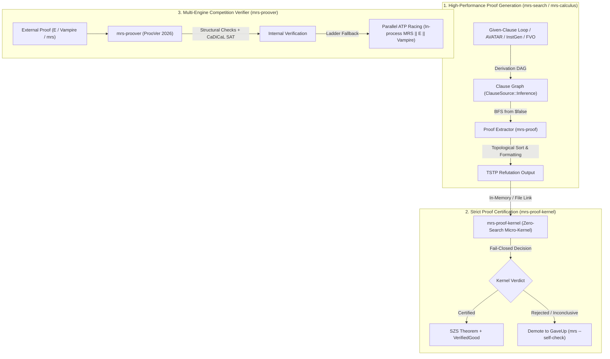

# Architecture Review: Auto Proof & Verification in `mrs`

The automated proof system in `mrs` separates high-performance theorem search from independent proof trust. While high-performance parallel superposition provers often treat proof output as an afterthought, `mrs` implements a closed-loop verification ecosystem spanning four dedicated crates:



---

## 1. Executive Summary & Proof Trust Boundary

| Component | Crate | Primary Role | Search / External Dependencies | Trust Boundary |
|---|---|---|---|---|
| **Proof Recording & Extraction** | `mrs-proof` | Records inferences, extracts minimal DAGs from `$false`, formats standard TSTP. | None | Search engine producer |
| **Strict Micro-Kernel** | `mrs-proof-kernel` | Independent, zero-search, purely functional mathematical proof checker. | **None** (Only depends on `mrs-core` & `mrs-tptp`) | **Zero-trust gate** (`--self-check`) |
| **Competition Verifier** | `mrs-proover` | Standalone competition verifier targeting ProoVer 2026 (leaderboard 1st: 148/150 pts). | CaDiCaL SAT solver, in-process `mrs`, external E/Vampire ladder | Scored competition entry |
| **Batch Verifier & Auditor** | `mrs-codex` | Parallel SQLite-backed corpus auditor supporting `--verify-mode kernel` & `competition`. | SQLite, Rayon | Offline benchmarking |

---

## 2. Layer 1: Proof Generation Pipeline (`mrs-search`, `mrs-calculus`, `mrs-proof`)

### 2.1 Provenance Tracking Model
In `mrs`, every clause maintains immutable ancestry data via `ClauseSource`:
- `ClauseSource::Input { name, role }`: Problem leaves referencing exact named axioms/hypotheses/conjectures from the problem file.
- `ClauseSource::Introduced { symbol }`: Fresh definitional extensions (e.g., Tseitin definitions `def_...` or Skolem symbols) carrying `new_symbols(definition, [...])`.
- `ClauseSource::Inference { rule, parents }`: First-order inferences citing exact parent `ClauseId`s and a standardized rule name.

### 2.2 Proof Recording Across Search Calculi
1. **Preprocessing & Clausification**:
   - Conjectures are negated into `negated_conjecture` with status `status(cth)`.
   - NNF conversions are labeled `fof_nnf_transformation`.
   - Skolemization steps record `skolemisation` with status `status(esa)`. (With **Leap 4A: Filtered Skolemization**, only active free variables are retained in witness arity).
   - Definitional CNF splits formulas into `cnf_transformation` steps citing their respective definitions.
2. **Superposition Calculus & Simplifications**:
   - Primary generating rules: `resolution`, `factoring`, `equality_resolution`, `equality_factoring`, `superposition`.
   - In-place rewriting (**Leap 1: In-Place Demodulation**): Rewritten clauses update their parent pointers to include both the source clause and the demodulating unit equality, guaranteeing that the derivation graph remains sound and acyclic.
   - Clause pruning (**Leap 4C: BCE & PLE**): Pure literal elimination and blocked clause elimination safely discard non-participating clauses; conjectures are protected to avoid pruning goal branches.
3. **Advanced Clause Splitting (AVATAR & CWA)**:
   - Components and branch refutations carry specialized `ClauseCertificate`:
     - `AvatarSplit`: Original disjunction and split component variables.
     - `AvatarComponent`: Projection to SAT branch literal (`spl0_k`).
     - `AvatarBranchRefutation`: Branch-local contradiction under component context.
     - `AvatarSatRefutation`: Final rollup referencing all branch roots and SAT trace (`frat-lrat` proof payload).
4. **SAT-Guided InstGen Refutations (Leap 5)**:
   - EPR refutations perform lazy MGU instantiations (`instantiate` / `instantiation`), followed by a propositional resolution refutation DAG. Ancestor closure ensures intermediate ground clauses cite their original input definitions.

### 2.3 Proof Extraction & TSTP Emission (`mrs-proof`)
- `extract_proof`: Performs backward BFS from the empty clause (`$false`) across `parents` and certificate nodes (`split_nodes`, `branch_roots`), collecting only the active refutation subgraph.
- `format_tstp`: Topologically sorts nodes, prepends the `% Proof : <path>` header, and formats every step according to standard TSTP conventions (`cnf(...)`, `fof(...)`, `status(thm)`, `status(esa)`, `status(cth)`).

---

## 3. Layer 2: The Strict Verification Micro-Kernel (`mrs-proof-kernel`)

The strict kernel is designed to eliminate false trust. It contains **no heuristics**, **no search loop**, and **no external dependencies**.

### 3.1 Trust Policy & Verdicts
The kernel returns one of three mutually exclusive outcomes:
1. `Certified`: Every single reachable step in the refutation was independently recomputed and verified by an exact logical check.
2. `Rejected(reason)`: The proof contains an unsound inference, an illegal rule application, a malformed parent pedigree, or an unprovable claim.
3. `Inconclusive(reason)`: The proof exceeds deterministic resource bounds or utilizes an inference rule not yet in the strict kernel's certified vocabulary.

> **Crucial Invariant**: In strict self-checking mode (`mrs --self-check`), **only `Certified` produces `% SZS status Theorem`**. Both `Rejected` and `Inconclusive` immediately demote the result to `% SZS status GaveUp`.

### 3.2 Certified Inference Vocabulary (25+ Rules)
The kernel recomputes conclusions from cited parents:
- **FOL First Principles**:
  - `resolution`: Full Robinson unification and resolvent reconstruction.
  - `subsumption_resolution`: Multiset matching with exact target literal deletion.
  - `factoring`: Multi-literal unification and condensation.
  - `equality_resolution` & `equality_factoring`: Reflexivity elimination and conditional paramodulation.
  - `superposition` & `demodulation`: Subterm rewriting under matching substitutions.
- **Clausal Preprocessing**:
  - `negated_conjecture`: $\neg \text{Conjecture} \equiv_\alpha \text{Step}$.
  - `fof_nnf_transformation`: Exact NNF tree transformation verification.
  - `skolemisation`: Enforces fresh symbols, exact arity, scoping, and dependency matching.
  - `cnf_transformation`: Certified Tseitin biconditionals and half-definitions.
- **Structural Rules**:
  - `instantiate` / `instantiation`: Universal quantifier and free-variable ground/term instantiations.
  - `modus_ponens`, `horn`, `consequence`, `disjunctive_syllogism`, `contrapositive`, `ex_falso`, `weaken`, `reflexivity`, `transitivity`, `split_conjunct`, `conjunction`.
- **SAT & Case Splits**:
  - Explicit AVATAR case splits and replayable CaDiCaL LRAT/FRAT SAT proof events.

### 3.3 Resource Limits & Determinism
`VerificationLimits` bounds execution:
- `max_proof_nodes` (default 50,000)
- `max_formula_nodes` (default 10,000)
- `max_parents` (default 128)
- `max_clause_literals` (default 1,024)
- `max_term_depth` (default 200)
- `max_equivalence_steps` (default 200,000)

If any threshold is exceeded, the kernel terminates deterministically and returns `Inconclusive`, preventing proof-parsing denial-of-service.

---

## 4. Layer 3: ProoVer 2026 Competition Verifier (`mrs-proover`)

`mrs-proover` is a competition-tuned proof verification engine. In the official CASC-J13 ProoVer division benchmark (100 problems, `PRV000+1` through `PRV099+1`), **`mrs-proover` ranks 1st with 148 / 150 points** (+34 points ahead of winner GAPT 2.20):

```
Rank 1 (Current HEAD):  148 pts  (50 Good, 49 Bad, 0 False Rejects, 0 Unsound, 1 Unknown)
Rank 2 (GAPT 2.20):     114 pts  (36 Good, 42 Bad, 6 False Rejects, 0 Unsound, 16 Unknown)
Rank 3 (VaLeaDate 0.1):  97 pts  (24 Good, 48 Bad, 23 False Rejects, 0 Unsound, 5 Unknown)
```

### 4.1 Scoring Asymmetry Management
ProoVer scoring penalizes false verification severely:
- Correct evil proof (`VerifiedBad`): **+2 pts**
- Correct valid proof (`VerifiedGood`): **+1 pt**
- Timeout / Inconclusive (`Unknown`): **0 pts**
- False rejection of a valid proof: **-1 pt**
- **False acceptance of an evil proof (`Unsound`)**: **-10 pts (Fatal)**

Because a single unsound result erases ten correct proofs, `mrs-proover` uses a **fail-safe conservative ladder**:
1. **Structural Checks**: Exact DAG validation, Skolem freshness, definition non-circularity.
2. **Propositional Fast-Path**: Direct CaDiCaL SAT solver validation for AVATAR and propositional inferences.
3. **Parallel ATP Ladder**:
   - Runs fast in-process `MrsAtp` (zero spawn overhead).
   - If undecided, races external `eprover` and `vampire` concurrently across competition cores.
   - As soon as one backend returns a definite verdict, losing backends are killed immediately via `AtomicBool` flags.
4. **Finite Model Finder (FMB)**: Disproves invalid steps by generating counter-models, turning would-be timeouts into `VerifiedBad` (+2 pts).

---

## 5. Layer 4: Runtime Self-Checking (`mrs --self-check`)

In `src/main.rs`, `--self-check` links search and certification directly in the CLI:
1. When search derives a refutation, `mrs` checks remaining wall-clock time against a 2-second safety reserve.
2. It feeds the problem and emitted TSTP proof into `mrs_proover::strict::verify_text` (in-memory for non-include problems) or `mrs_proof_kernel::verify_strict`.
3. If the kernel returns `Certified`:
   - Prints `% SZS status Theorem` (or `Unsatisfiable`).
   - Emits the validated `% SZS output start Proof`.
   - Records `self_check=Certified` in telemetry.
4. If the kernel returns `Rejected` or `Inconclusive`:
   - Emits `% Strict self-verification failed: <reason>`.
   - **Overrides status to `% SZS status GaveUp`**.
   - Suppresses the unverified proof.
   - Records `self_check=Rejected` in telemetry.

---

## 6. Critical Findings & Open Action Items

### Finding 1: Rule Name Aliasing (`instantiate` vs. `instantiation`)
- **Status**: **Resolved**.
- **Detail**: The strict kernel previously only checked for rule name `"instantiate"`, whereas standard TPTP and InstGen emitted `"instantiation"`. Running `mrs --self-check problems/socrates.p` returned `Inconclusive: node c13 uses unsupported strict rule instantiation`. Aliasing `"instantiation"` alongside `"instantiate"` in `mrs-proof-kernel` allows `socrates.p` to certify end-to-end (`self_check=Certified`).

### Finding 2: Literal Ordering in Clausal Instantiation (The AC-Order Gap)
- **Status**: **Pending Implementation**.
- **Detail**: In `crates/mrs-proof-kernel/src/lib.rs`, `match_universal_instance` matches `Formula::Or(left)` against `Formula::Or(right)` using rigid pairwise positional iteration. In clausal logic, clauses are multisets of literals ($A \lor B \equiv B \lor A$). When clausification or InstGen permutes the internal literal order, `verify_instantiation` rejects the step (`instantiate conclusion is not a parent instance`).
- **Remedy**: Extend `verify_instantiation` to perform multiset/AC matching over disjunctions when matching clauses, identical to how `verify_resolution` and `subsumption_resolution` already match literals modulo AC.

### Finding 3: The Last 2-Point Gap on ProoVer-2026 (148 $\to$ 150 pts)
- **Status**: **Target for ProoVer 2026 completion**.
- **Detail**: Across the 100-problem CASC-J13 corpus, only problem `PRV067+1` currently returns `Unknown`. Classifying `PRV067+1` as `VerifiedBad` completes a perfect 150/150 points run.
