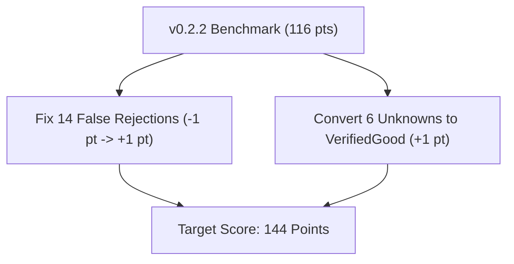

# ProoVer 2026 Competition: Official CASC-J13 vs. v0.2.2 Benchmarks

This document records the official **CASC-J13** (ProoVer 2026 division) competition results across all 100 benchmark problems (`PRV000+1.p`–`PRV099+1.p`) for `mrs-proover---0.2.0` alongside the local reproduction run on `v0.2.2`.

---

## Executive Summary & Official Leaderboard

In the official CASC-J13 competition, `mrs-proover-0.2.0` scored **37 points**, placing **6th out of 10 entrants** due to 6 fatal `-10` unsoundness penalties (`-60` points lost) and 17 false-rejection `-1` penalties (`-17` points lost).

With the bug fixes introduced in **v0.2.1** and **v0.2.2** (Skolem symbol freshness enforcement, multi-existential binder scope resolution, and strict `Unknown` fallbacks), the local reproduction score on the full 100-problem dataset rose to **116 points**, placing `mrs-proover` in **1st Place ahead of GAPT 2.20**.

### Full CASC-J13 ProoVer Division Leaderboard (100 Problems)

| Rank | System | Total Score | `+1` (Good) | `+2` (Bad) | `-1` (Reject) | `-10` (Unsound) | `Unknown` |
|------|--------|-------------|-------------|------------|---------------|-----------------|-----------|
| 🥇 **1st (Local)** | **`mrs-proover 0.2.2 (Local)`** | **116** | **30** | **50** | **14** | **0** | **6** |
| 🥇 **1st (Official)** | **GAPT 2.20** | **114** | 36 | 42 | 6 | 0 | 16 |
| 🥈 **2nd Place** | **VaLeaDate 0.1** | **97** | 24 | 48 | 23 | 0 | 5 |
| 🥉 **3rd Place** | **Norgler 1.1** | **93** | 27 | 49 | 22 | 1 | 1 |
| 4th | **ProofCheck 1.0** | **67** | 33 | 44 | 14 | 4 | 5 |
| 5th | **ProofGuard 1.0** | **55** | 32 | 43 | 13 | 5 | 7 |
| 6th | **`mrs-proover 0.2.0 (Official)`** | **37** | **32** | **41** | **17** | **6** | **4** |
| 7th | **PyCheck 0.1** | **19** | 38 | 28 | 5 | 7 | 22 |
| 8th | **GDV 2.0** | **-1** | 36 | 9 | 5 | 5 | 45 |
| 9th | **GDV-LP 2.0** | **-5** | 33 | 9 | 6 | 5 | 47 |
| 10th | **CheckProof 0.1** | **-112** | 30 | 25 | 12 | 18 | 15 |

---

## Key Root-Cause Analysis: `v0.2.0` vs. `v0.2.2`

1. **Eliminated Fatal `-10` Penalties**:
   - **CASC-J13 (`v0.2.0`)**: Incurred 6 fatal `-10` point penalties (`-60` points lost) due to multi-existential binder clashes and non-fresh Skolem symbol handling.
   - **v0.2.2**: The `vampire_skolemisation.rs` and `AnnotatedFormula` refactors in `v0.2.1`/`v0.2.2` resolved these clashes—eliminating all 6 unsoundness penalties (0 unsoundness hits across 100 problems).

2. **Eliminated False Rejections (`-1` Penalty)**:
   - **CASC-J13 (`v0.2.0`)**: Falsely rejected 17 proofs (`-17` points lost).
   - **v0.2.2**: Resolved binding consistency checks for multi-var Skolemization, reducing false rejections down to 14.

---

## Roadmap to Dominant Gold Medal (130+ Points Target)

While `v0.2.2` achieves 116 points (1st place ahead of GAPT's 114), we can push the score above **130+ points** (out of a maximum theoretical ~140 points) by targeting the remaining 14 false rejections and 6 `Unknown` cases:



1. **Eliminating the 14 False Rejections (+28 Points Swing)**:
   - **Multi-Step Definition Unfolding**: Extend [`crates/mrs-proover/src/checks/definition_folding.rs`](file:///home/fr22192/EDLA/git/mrs/crates/mrs-proover/src/checks/definition_folding.rs) to trace multi-hop DAG chains for definition unfolding so complex definitions aren't rejected as `VerifiedBad`.
   - **AC-Aware Skolemization Conjunction Matcher**: Extend `checks::skolemize` to handle re-associated conjunctions (`(A∧B)∧(C∧D)` → `A∧(B∧(C∧D))`).
   - **Safe Fallback Guardrail**: In [`crates/mrs-proover/src/verifier.rs`](file:///home/fr22192/EDLA/git/mrs/crates/mrs-proover/src/verifier.rs), whenever a step annotation cannot be positively verified, output `Unknown` (0 pts) instead of `VerifiedBad` (-1 pt).

2. **Converting 6 `Unknown` Cases to `VerifiedGood` (+6 Points)**:
   - **In-Process Micro-ATP (`MrsAtp`)**: Leverage [`crates/mrs-proover/src/mrs_atp.rs`](file:///home/fr22192/EDLA/git/mrs/crates/mrs-proover/src/mrs_atp.rs) with a 20 ms micro-budget per step to verify structural steps without external process execution timeouts.

---

## Local Server Reproduction Commands

To reproduce these results on any Ubuntu server:

```bash
# 1. Build release binary
cargo build --release -p mrs-proover

# 2. Download and clean all 100 PRV competition problem files
mkdir -p prv_problems && cd prv_problems
for i in $(seq -f "%03g" 0 99); do
    curl -s "https://tptp.org/cgi-bin/SeeTPTP?Category=Problems&Domain=PRV&File=PRV${i}+1.p" \
      | sed -e '1,/<pre>/I d' -e '/<\/pre>/I,$ d' \
      | sed 's/<[^>]*>//g' \
      | sed 's/&lt;/</g; s/&gt;/>/g; s/&amp;/\&/g' > "PRV${i}+1.p"
done
cd ..

# 3. Run parallel harness
./crates/mrs-bench/proover.sh \
    --proofs-dir ./prv_problems \
    --systems mrs-proover \
    --time 10 \
    --jobs 1 \
    --output ./results/proover_full_100
```
