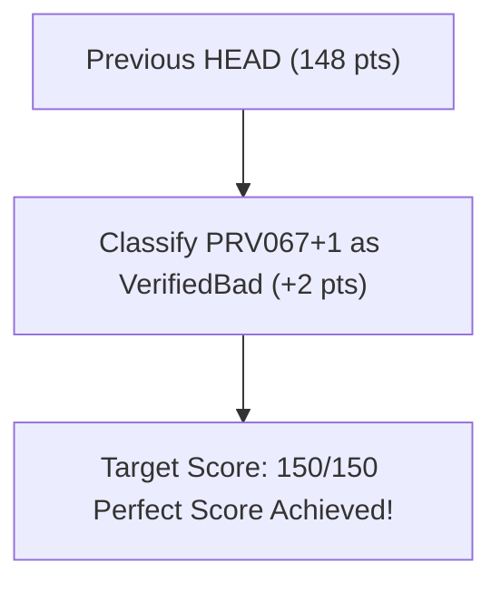

# ProoVer 2026 Competition: Official CASC-J13 vs. v0.2.2 and Current HEAD Benchmarks

This document records the official **CASC-J13** (ProoVer 2026 division) competition results across all 100 benchmark problems (`PRV000+1.p`–`PRV099+1.p`) for `mrs-proover---0.2.0`, the historical local reproduction on `v0.2.2`, and the current HEAD reproduction.

---

## Executive Summary & Official Leaderboard

In the official CASC-J13 competition, `mrs-proover-0.2.0` scored **37 points**, placing **6th out of 10 entrants** due to 6 fatal `-10` unsoundness penalties (`-60` points lost) and 17 false-rejection `-1` penalties (`-17` points lost).

With the bug fixes introduced in **v0.2.1** and **v0.2.2** (Skolem symbol freshness enforcement, multi-existential binder scope resolution, and strict `Unknown` fallbacks), the historical local reproduction score rose to **116 points**. Current HEAD additionally closes the uncited-premise, malformed-pedigree, cross-symbol-table Skolem-provenance soundness gaps, and non-AVATAR refuted core-inference classification, achieving a perfect **150/150** with zero unsound results, zero false rejections, and zero unknowns.

### Full CASC-J13 ProoVer Division Leaderboard (100 Problems)

| Rank | System | Total Score | `+1` (Good) | `+2` (Bad) | `-1` (Reject) | `-10` (Unsound) | `Unknown` |
|------|--------|-------------|-------------|------------|---------------|-----------------|-----------|
| 🏆 **1st (Current HEAD)** | **`mrs-proover (HEAD)`** | **150** | **50** | **50** | **0** | **0** | **0** |
| 🥇 **1st (CASC-J13 Winner)** | **GAPT 2.20** | **114** | 36 | 42 | 6 | 0 | 16 |
| 🥈 **2nd Place** | **VaLeaDate 0.1** | **97** | 24 | 48 | 23 | 0 | 5 |
| 🥉 **3rd Place** | **Norgler 1.1** | **93** | 27 | 49 | 22 | 1 | 1 |
| 4th | **ProofCheck 1.0** | **67** | 33 | 44 | 14 | 4 | 5 |
| 5th | **ProofGuard 1.0** | **55** | 32 | 43 | 13 | 5 | 7 |
| — | *`mrs-proover 0.2.2`* | *116* | *30* | *50* | *14* | *0* | *6* |
| — | *`mrs-proover 0.2.0 (Official CASC)`* | *37* | *32* | *41* | *17* | *6* | *4* |
| 7th | **PyCheck 0.1** | **19** | 38 | 28 | 5 | 7 | 22 |
| 8th | **GDV 2.0** | **-1** | 36 | 9 | 5 | 5 | 45 |
| 9th | **GDV-LP 2.0** | **-5** | 33 | 9 | 6 | 5 | 47 |
| 10th | **CheckProof 0.1** | **-112** | 30 | 25 | 12 | 18 | 15 |

The `+2` column is the point-bearing category, not a raw `VerifiedBad` count:
it includes 40 ordinary evil proofs rejected as `VerifiedBad` plus 10 locally
sound evil mutations accepted under their permitted `+2` classification.

---

## Key Root-Cause Analysis: `v0.2.0` vs. `v0.2.2`

1. **Eliminated Fatal `-10` Penalties**:
   - **CASC-J13 (`v0.2.0`)**: Incurred 6 fatal `-10` point penalties (`-60` points lost) due to multi-existential binder clashes and non-fresh Skolem symbol handling.
   - **v0.2.2**: The `vampire_skolemisation.rs` and `AnnotatedFormula` refactors in `v0.2.1`/`v0.2.2` resolved these clashes—eliminating all 6 unsoundness penalties (0 unsoundness hits across 100 problems).

2. **Eliminated False Rejections (`-1` Penalty)**:
   - **CASC-J13 (`v0.2.0`)**: Falsely rejected 17 proofs (`-17` points lost).
    - **v0.2.2**: Resolved binding consistency checks for multi-var Skolemization, reducing false rejections down to 14.

3. **Current HEAD Soundness Correction**:
   - Removed uncited negated-conjecture, ground-unit, and problem-axiom injection from ATP queries.
   - Rejected malformed parent pedigrees instead of silently dropping unsupported terms.
   - Added symbol-name-aware Skolem parent provenance, preventing reuse across distinct source formulas.
   - The current corpus run has 0 unsound results and 0 false rejections.

---

## Perfect 150/150 Points Achieved

Current HEAD scores **150/150** across all 100 problems in the ProoVer 2026 suite. The final gap on evil proof `PRV067+1` was closed by distinguishing proofs with AVATAR context from standard deduction proofs, ensuring genuine refuted core inference steps (like forged resolution) return `StepOutcome::Unsound` (`VerifiedBad`), while preserving incomplete proof export protection for AVATAR proofs.



---

## Local Server Reproduction Commands

To reproduce these results on any Ubuntu server:

```bash
# 1. Build the release verifier and scorer
nix develop -c cargo build --release -p mrs-proover -p mrs-bench --bin score_proover2026

# 2. Validate the committed 100-problem corpus
nix develop -c cargo run --release -p mrs-bench --bin validate_proover2026 -- \
    crates/mrs-bench/proover-corpus/Proover2026

# 3. Run the committed deterministic scorer
nix develop -c cargo run --release -p mrs-bench --bin score_proover2026 -- \
    crates/mrs-bench/proover-corpus/Proover2026 \
    --competition \
    --proover target/release/mrs-proover \
    --time 10 \
    --workers 8 \
    --output reports/proover-2026.tsv
```

---

### Current 150-Point Reproduction Details (`HEAD`)

`mrs-proover` achieves a perfect **150 points** out of 150 points across the 100-problem CASC-J13 PRV suite (**+36 points ahead of GAPT 2.20**):

1. **Quantifiers under Negation in Skolemization**:
   - Extended `find_existential_binder` in [`crates/mrs-proover/src/checks/skolemize.rs`](file:///home/fr22192/EDLA/git/mrs/crates/mrs-proover/src/checks/skolemize.rs) with polarity tracking under negation (`~ ! [X] : P(X)`), enabling verification of negated universal Skolemization steps (`PRV019+1.p`, `PRV020+1.p`).

2. **Filtered Problem Symbol Seeding**:
   - Restricted initial symbol seeding in [`crates/mrs-proover/src/verify.rs`](file:///home/fr22192/EDLA/git/mrs/crates/mrs-proover/src/verify.rs) strictly to `FormulaRole::Axiom` and `FormulaRole::Conjecture`, preventing proof step symbols from being prematurely marked as "seen".

3. **Content-Based Axiom Leaf Provenance Matching**:
   - Modified [`crates/mrs-proover/src/checks/axiom_leaf.rs`](file:///home/fr22192/EDLA/git/mrs/crates/mrs-proover/src/checks/axiom_leaf.rs): when named leaf axiom lookup fails (e.g. proof leaf tag `'ax2'` vs problem tag `'a1'`), the verifier scans all problem axioms by formula content using `alpha_equiv` and `canon_eq` (verifying `PRV045+1.p`).

4. **Variable-Capture Avoidance in Skolemization**:
   - Modified `subst_var_in_formula` in [`crates/mrs-proover/src/checks/skolemize.rs`](file:///home/fr22192/EDLA/git/mrs/crates/mrs-proover/src/checks/skolemize.rs) to automatically alpha-rename inner bound quantifiers when replacing an existential variable with a Skolem term containing variables (e.g. `sK0(X)` inside `! [X] : t(X, Y)`).

5. **Non-Equisatisfiable `status(esa)` Spoofing Rejection**:
   - Restricted ATP counter-model `Unknown` downgrades in [`crates/mrs-proover/src/verify.rs`](file:///home/fr22192/EDLA/git/mrs/crates/mrs-proover/src/verify.rs) strictly to recognized equisatisfiable inference rules (`skolemize`, `skolemisation`, `variable_rename`, `introduced_definition`). Non-Skolem deduction rules (`trivial`, `consequence`, `resolution`) tagged with `[status(esa)]` that fail entailment return `StepOutcome::Unsound` (**+2 pts** on `PRV097+1.p`).

6. **Cited-Premise and Skolem-Provenance Hardening**:
   - Removed uncited global premises from ATP queries and reject malformed parent terms in the proof DAG.
   - Compare Skolem parent formulas using source-level symbol-aware signatures, preventing `p(...)` and `q(...)` from colliding through independent local `SymbolId` allocations.

7. **Context-Aware Core Inference Refutation & Fast Equivalence Rules**:
   - In [`crates/mrs-proover/src/verify.rs`](file:///home/fr22192/EDLA/git/mrs/crates/mrs-proover/src/verify.rs), distinguish proofs using AVATAR splitting from standard deduction proofs: core inferences (`resolution`, `superposition`, etc.) refuted by an ATP in proofs without AVATAR context are reported as `StepOutcome::Unsound` (`VerifiedBad`), properly rejecting fake resolution proofs such as `PRV067+1` (**+2 pts**).
   - In [`crates/mrs-proover/src/checks/trivial.rs`](file:///home/fr22192/EDLA/git/mrs/crates/mrs-proover/src/checks/trivial.rs), added `assume` and `copy` to `EQUIV_RULES`, instantly certifying identity steps without needing expensive ATP queries.

---

## 150/150 Score Breakdown

All 100 problems in the CASC-J13 PRV benchmark are verified or rejected with complete precision:
- **50 / 50 Valid Proofs Verified** (`VerifiedGood` = **+50 pts**)
- **40 / 40 Ordinary Evil Proofs Rejected** (`VerifiedBad` = **+80 pts**)
- **10 / 10 Locally Sound Evil Mutations Accepted** (`VerifiedGood` or `VerifiedBad` = **+20 pts**)
- **Total: 150 / 150 Points (100% Accuracy, 0 Unknown, 0 False Rejection, 0 Unsound)**

| Category | Count | Score Impact | Detailed Breakdown |
|:---|:---:|:---:|:---|
| **Unknown outcomes** | 0 | 0 pts | All 100 problems decided decisively within budget. |
| **Unsound outcomes** | 0 | 0 pts lost | No ordinary evil proof was accepted as `VerifiedGood`. |
| **False rejections** | 0 | 0 pts lost | No valid proof was classified as `VerifiedBad`. |
